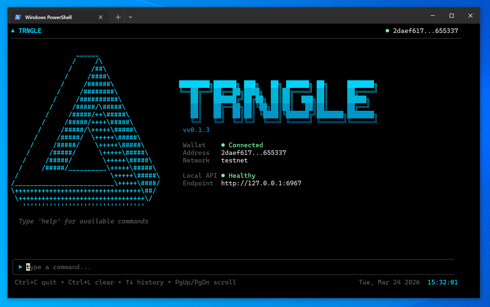

<p align="center">
  
</p>

<p align="center">
  <strong>Trade tokens on Canton Network from your terminal.</strong><br/>
  Non-custodial. Local-first. Open source.
</p>

<p align="center">
  <a href="https://github.com/trngle-xyz/cli/releases"></a>
  <a href="https://github.com/trngle-xyz/cli/releases"></a>
</p>

---

trngle is a self-contained terminal application for swapping tokens on [Canton Network](https://www.canton.network/). It connects to your [Loop](https://www.digitalasset.com/loop) wallet, fetches live quotes from the operator, and signs every transaction locally with your private key. Nothing is custodial — your keys never leave your machine.

> **Testnet only** — this release trades test tokens on Canton Network testnet. Mainnet support is planned.

## Install

**macOS / Linux:**

```sh
curl -fsSL https://cli.trngle.xyz/install.sh | sh
```

**Windows (PowerShell):**

```powershell
irm https://cli.trngle.xyz/install.ps1 | iex
```

No dependencies. The installer downloads a single binary and adds it to your PATH.

## Quick Start

```
trngle
```

A setup wizard runs on first launch:

1. **Network** — select testnet
2. **Wallet** — connect your Loop wallet (ed25519 key + party ID)
3. **Local API** — optionally enable a REST API for programmatic access

Once connected:

```
❯ quote 100 CC to CBTC
```

Review the rate, press **Y** to confirm, and the swap executes on-chain.

## Commands

| Command | Description |
|---------|-------------|
| `quote <amount> <from> to <to>` | Request a swap quote (e.g. `quote 100 CC to CBTC`) |
| `balance` | Show wallet balances |
| `address` | Show your wallet address |
| `trades` | View trade history |
| `transfers` | View pending incoming transfers |
| `settings` | Open settings (network, API port, keys) |
| `theme <name>` | Change color theme |
| `lang <code>` | Change language (en, fr, it, es, ru, zh) |
| `help` | Show available commands |
| `quit` | Exit |

## Supported Assets

| Asset | Description |
|-------|-------------|
| CC | Canton Coin (Amulet) |
| CBTC | Canton BTC |
| USDXLR | Canton USD stablecoin |

## How It Works

1. You request a quote — trngle calls the operator API
2. You review the price in your terminal
3. On confirmation, trngle signs the transaction locally and submits it on-chain via your Loop wallet
4. The operator settles the trade — both sides receive their tokens

The operator provides liquidity and settlement. trngle provides the interface. All signing happens on your machine.

## Local API

trngle can run an optional REST API on localhost for programmatic trading. Enable it during setup or with the `--api-only` flag.

```
trngle --api-only --port 8080
```

Endpoints include `/health`, `/balances`, `/trade/quote`, `/trade/{id}/confirm`, `/trades`, `/transfers`, and a `/ws` WebSocket for real-time trade events. See [docs/API.md](docs/API.md) for full documentation.

## Configuration

Config is stored at `~/.trngle/config.json`. Trade history is in `~/.trngle/history.db`.

```
trngle --trngle-api-url https://your-api.example.com
```

## Building from Source

```sh
git clone https://github.com/trngle-xyz/cli.git
cd cli
make build
./trngle
```

Requires Go 1.21+.

## Uninstall

**macOS / Linux:**

```sh
curl -fsSL https://cli.trngle.xyz/uninstall.sh | sh
```

**Windows (PowerShell):**

```powershell
irm https://cli.trngle.xyz/uninstall.ps1 | iex
```

Removes the binary and optionally your config/history at `~/.trngle/`.

